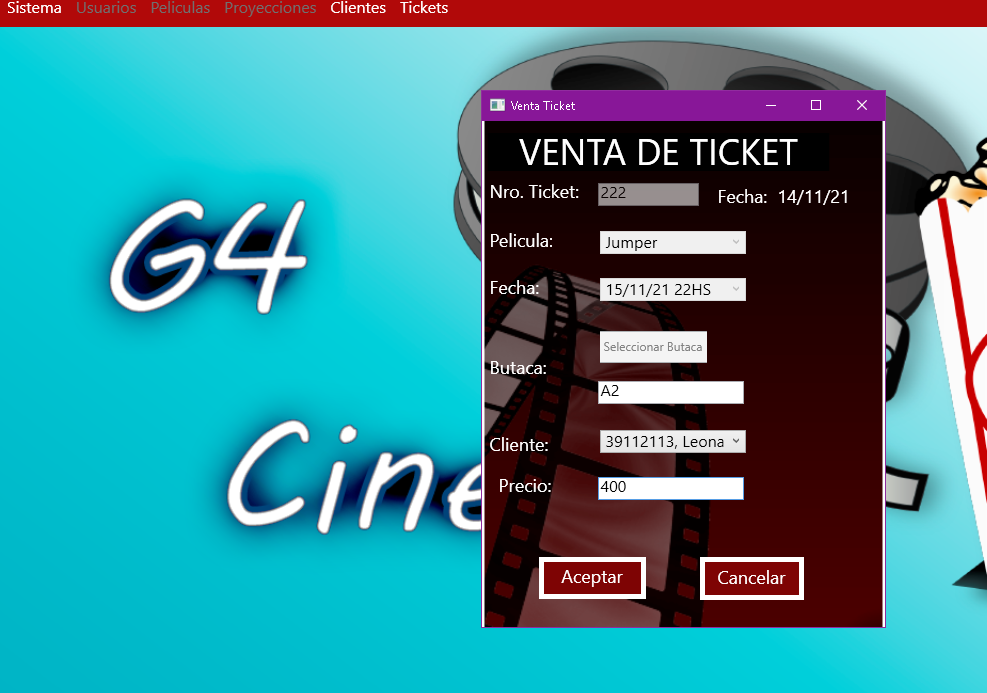

# Cinema-Software
EN:
This is a software for a cinema, it can sells tickets and has a CRUD of users, movies, projections, clients and some other stuffs like the creation of PDF documents. 
This is a project that I created with my classmates at the university using C# - .NET - WPF - MySQL 
This software validates all entry fields and every main module has a CRUD

ES:
Este es un software para un cine, puede vender tickets y tiene una gestion de usuarios, clientes, proyecciones y algunas otras cosas como la creación de documentos PDF. 
Es un proyecto que creamos junto con mi equipo en la universidad. 

Este sistema valida los campos de los registros y todas las gestiones tienen su CRUD.

## Users - Usuarios (It works very similar for clients - Para los clientes funciona muy similar)

You can create a pdf with the userlist - Puedes crear un pdf con la lista de usuarios

## Movies - Películas 

You can add a trailer video and an image to the movie you are adding. The video will play automatically to make sure you're adding the correct one.

Puedes añadir un trailer y una imagen a la película que estes agregando. 

El video se reproducirá automaticamente para que verifiques que estas agregando el video correcto.

## Projections - Proyecciones

You can search for projections using dates or using movies' name

Puedes buscar las proyecciones por fechas o por películas

## Selling - Venta
Here we switch the user, because the admin has not permission for selling

Aquí cambiamos de usuario porque el admin no tiene permiso para vender.

You choose a movie, and the projection list will show only the projections for that movie.

Eliges una película y la lista de proyecciones solamente mostrará las proyeccinoes de esa película.

You can choose the sit number, in the next selling this sit will be occupied

Puedes seleccionar tu asiento, en la próxima venta ese estará ocupado.

After the selling is finished it creates a ticket that can be printed.

Luego de que finaliza la venta se genera un ticket que se puede imprimir

